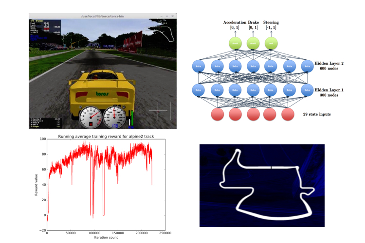

# torcs-autopilot

Deep reinforcement learning for simulated autonomous driving

Paper can be found [here](http://cs229.stanford.edu/proj2016/report/Ganesh-Charalel-DasSarma-Xu-DeepReinforcementLearningForSimulatedAutonomousDriving-report.pdf).

This implementation was adapted using Ben Lau's extremely helpful [code and article](https://yanpanlau.github.io/2016/10/11/Torcs-Keras.html).  We implemented some variations on this, but relied on his code as starting framework to run and test the TORCS agent.
